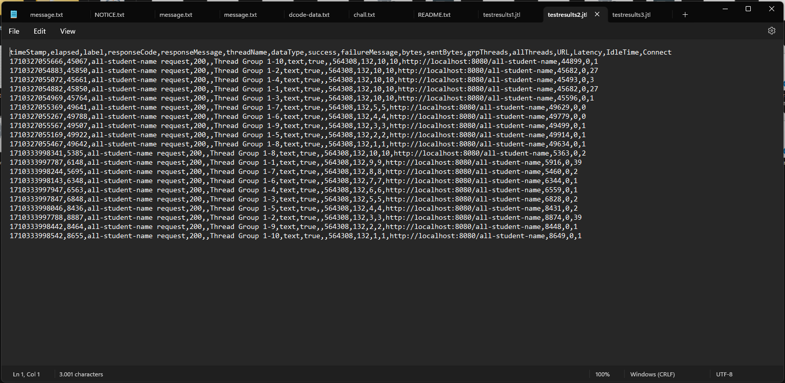

# Refleksi Modul 5

## Pertanyaan Refleksi

1. Salah satu perbedaan yang paling dominan adalah performance testing menggunakan JMeter lebih berlaku untuk testing performa secara keseluruhan dalam skala produksi. Sebagai contohnya, pada performance testing aplikasi ini, digunakan endpoint website untuk testing secara langsung, dan yang jadi _benchmark_ adalah waktu untuk mengakses endpoint hingga seluruh halaman ter-_load_. Sementara itu, profiling menggunakan IntelliJ Profiler lebih berlaku untuk testing aplikasi dari sisi development. Yang menjadi _benchmark_ testing adalah performa berbagai fungsi, sehingga kita dapat mengetahui apabila ada fungsi yang kurang optimal. Keduanya memiliki tujuan yang sama, yaitu untuk memberikan _benchmark_ agar aplikasi dapat dioptimisasi.

2. Profiling memberikan saya informasi mengenai apakah ada fungsi yang memberatkan aplikasi dan bisa untuk dioptimisasi. "Berat" dalam hal ini adalah memiliki performa yang lambat dan _running time_ yang lama. Informasi yang diberikan antara lainnya adalah CPU time, total time, penggunaan CPU, dan sebagainya. Melalui informasi ini, saya dapat memfokuskan bagian kode yang berat dan mengoptimisasi hanya bagian-bagian yang perlu dioptimisasi. 

3. Iya, karena melalui profiler IntelliJ, saya dapat mencari method atau fungsi yang memakan waktu paling banyak sebelum optimisasi. Inilah yang disebut dengan bottleneck, yaitu perbedaan performa secara signifikan pada satu bagian kode yang malah memberatkan performa secara keseluruhan. Analisa juga dapat lebih mudah dilakukan, karena IntelliJ profiler memberikan berbagai opsi untuk mengakses informasi performa, seperti flame graph, call tree, method list, timeline, dan events.

4. Yang paling berat dalam performance testing adalah apabila performance testing dilakukan dalam skala besar. Selain karena waktunya yang relatif lama, komputer saya yang tidak begitu optimal spesifikasinya melambat dalam menggunakan semua aplikasi. Hal tersebut karena semua _resource_ digunakan untuk melakukan testing dalam skala besar tersebut. Solusinya...hanya menunggu. Selain itu, tantangan lain terdapat pada melakukan _refactoring_ dan analisa profiler IntelliJ, karena membutuhkan kejelian dan ide-ide kreatif untuk melakukan _refactoring_ yang kreatif. Solusinya adalah dengan berfokus pada method-method yang "berat" saja agar waktu tidak terbuang banyak.

5. Salah satu keuntungan yang saya dapatkan adalah saya tidak perlu menggunakan _tools_ eksternal untuk melakukan testing performa. Selain itu, saya juga bisa langsung mengetahui dari mana asal _bottleneck_ pada aplikasi saya, sehingga bisa saya optimisasi secara langsung.

6. Berdasarkan pengujian yang saya lakukan, IntelliJ Profiler dan JMeter menunjukkan hasil yang konsisten, seperti ketika aplikasi performanya buruk dan ketika aplikasi performanya baik. Apabila terjadi inkonsistensi, saya akan memeriksa kembali konfigurasi testing, baik pada JMeter maupun IntelliJ Profiler. Bisa saja terdapat kesalahan konfigurasi sehingga hasil testing berbeda.

7. Optimisasi yang saya lakukan antara lain:
   - Mengurangi pemanggilan method dan iterasi bersarang pada pemanggilan `getAllStudentsWithCourse`. Setelah optimisasi yang saya lakukan, iterasi dilakukan secara efektif dan tidak bersarang sehingga berjalan dalam kompleksitas yang cenderung linear.
   - Mengoptimisasi query ke basis data pada method `findStudentsWithHighestGpa()`. Pada optimisasi yang saya lakukan, saya menggunakan query yang bisa mengambil data Student dengan urutan dari GPA tertinggi, kemudian saya limit hanya untuk mengambil 1 data pertama. Dari optimisasi tersebut, saya buat sebuah fungsi di service yang bisa dipanggil.
   - Menggunakan struktur data `StringBuilder` sebagai pembentuk string yang lebih efisien. Struktur data ini lebih efisien digunakan untuk membangun sebuah string dibandingkan dengan menggunakan tipe data String primitif.
   Untuk menguji fungsionalitas, saya hanya menjalankan kembali aplikasi dan mengecek _endpoint_ yang tersedia dan memastikan hasil yang ditampilkan sama.

## Screenshot Performance Testing & Profiling

### Test Plan 1 (`/all-student`)
JMeter

Command line

Test log

Test log setelah optimisasi

Dapat dilihat bahwa ada peningkatan performa dari ~450,000 milliseconds menjadi ~15,000 milliseconds, optimisasi yang terjadi adalah sekitar 96,67%.

### Test Plan 2 (`/all-student-name`)
JMeter

Command line

Test log

Test log setelah optimisasi

Dapat dilihat bahwa ada peningkatan performa dari ~45,000 milliseconds menjadi ~5,000 milliseconds, optimisasi yang terjadi adalah sekitar 88,89%.

### Test Plan 3 (`/highest-gpa`)
Jmeter

Command line

Test log

Test log setelah optimisasi

Dapat dilihat bahwa ada peningkatan performa cukup ekstrim dari ~1,500 milliseconds menjadi ~20 milliseconds, optimisasi yang terjadi adalah sekitar 98,66%.